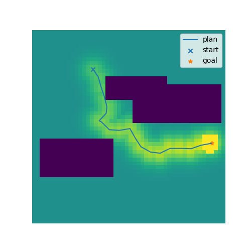
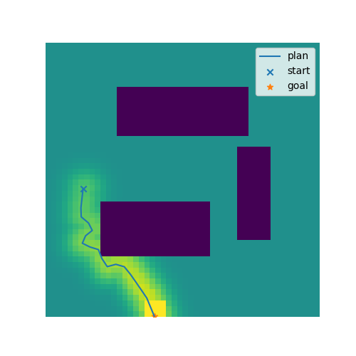

# Obstacle avoidance environment for training plan-conditioned policies
Toy RL environment for goal- or plan-conditioned RL. The openAI gym API is used.

## 2D maze environment with changing obstacles
This is a simple 2D maze environment with obstacles.
The size and location of the obstacles change each time `env.reset()` is called. 3 random examples are shown below:
 | |
:-------------------------:|:-------------------------:|:-------------------------:
Reset configuration ex. 1             |  Reset configuration ex. 2           |  Reset configuration ex. 3

A simple RRT planner is used to plan a feasible trajectory after each `env.reset`.
If the environment is used in plan-conditioned mode, this plan is exposed via the openAI gym API as the desired goal.
A plan-conditioned RL agent like L2E (https://github.com/ischubert/l2e) can then learn to execute this plan using the FV-RS reward provided by the environment (as indicated by the heatmap).

Alternatively, the environment can also be used in goal-conditioned mode.
Since the obstacles change at each reset, learning a purely goal-conditioned policy, e.g. with Hindsight Experience Replay [Andrychowicz et al. (2017)], will however result in suboptimal behavior.


## RRT planner
The code for the RRT planner is based on https://gist.github.com/Fnjn/58e5eaa27a3dc004c3526ea82a92de80
Which is licensed under the following license:
```
MIT License
Copyright (c) 2019 Fanjin Zeng
This work is licensed under the terms of the MIT license, see <https://opensource.org/licenses/MIT>.
```

# Literature
Original paper on L2E:

[_I.Schubert, D.Driess, O.Oguz, and M.Toussaint_: **Learning to Execute: Efficient Learning of Universal Plan-Conditioned Policies in Robotics**. NeurIPS (2021)](https://openreview.net/pdf?id=lEkPb2Rhm7)

Original paper on FV-RS:

[_I.Schubert, O.Oguz, and M.Toussaint_: **Plan-Based Relaxed Reward Shaping for Goal-Directed Tasks**. ICLR (2021)](https://openreview.net/pdf?id=w2Z2OwVNeK)

# Installation
Install with editable files using pip:
```
pip install -e .
```